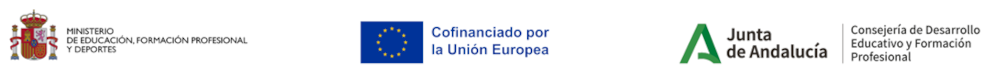

# Sistema-de-telemetr-a-multisensorial-para-monitoreo-de-calidad-del-agua.

Repositorio creado dentro del proyecto Sistema de telemetría multisensorial para monitoreo de la calidad del agua, 
proyecto subvencionado dentro de los Proyectos de innovación en digitalización aplicada (Medida 3.e.14 ) 

# 🌊 Laboratorio de Sensores de Agua con Arduino / ESP32

Repositorio de prácticas para probar sensores DFRobot con Arduino IDE.

## 📦 Sensores disponibles

| Código | Sensor | Archivo |
|---|---|---|
| SEN0169 | Sensor de pH analógico PRO | [SEN0169.ino](sensores/SEN0169.ino) |
| SEN0189 | Sensor de turbidez analógico | [SEN0189.ino](sensores/SEN0189.ino) |
| SEN0237 | Sensor de oxígeno disuelto | [SEN0237.ino](sensores/SEN0237.ino) |
| SEN0244 | Sensor TDS | [SEN0244.ino](sensores/SEN0244.ino) |
| SEN0507 | Sensor capacitivo de nivel industrial | [SEN0507.ino](sensores/SEN0507.ino) |
| SEN0509 | Sensor capacitivo de nivel para tubo 6 mm | [SEN0509.ino](sensores/SEN0509.ino) |
| SEN0681 | Sensor oxígeno disuelto RS485 | [SEN0681.ino](sensores/SEN0681.ino) |

## 🧪 Objetivo
Cada práctica permite al alumno:
- Conectar el sensor.
- Cargar el código `.ino`.
- Leer datos por el monitor serie.
- Interpretar la medida obtenida.

## 🛠️ Material necesario
- Arduino IDE
- Placa Arduino / ESP32 / FireBeetle
- Cable USB
- Sensor correspondiente

## 🚀 Cómo usar
1. Abrir la carpeta del sensor.
2. Abrir el archivo `.ino`.
3. Seleccionar la placa en Arduino IDE.
4. Seleccionar el puerto.
5. Subir el programa.
6. Abrir el monitor serie.
